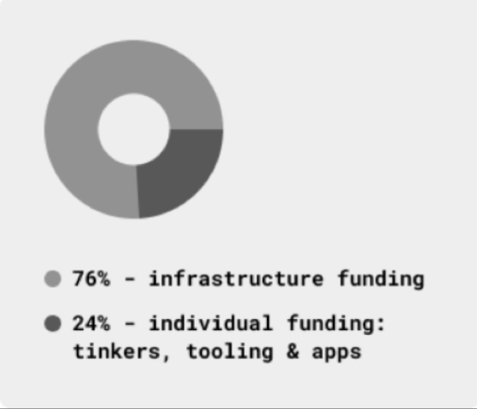

# Gno.land Funding and Grants Program - Progress So Far

# Quarterly Report: Q3 2023

We launched the [Gno.land Funding and Grants](https://github.com/gnolang/ecosystem-fund-grants) program in July 2023 to encourage talented and passionate developers to interact with Gno.land, help build core infrastructure and tooling, and enhance the usability of the platform. After establishing a review process to streamline the program and identify core areas that need the most work, we ran with our first cohort of grantees in Q3, awarding four grants from a total of seven submissions (to two teams and two individuals). Full details of grant submissions, scope, and funding can be found on GitHub, but here’s a summary of the program’s progress so far and what’s coming up in Q4.

## Q3 Funding Breakdown

The total grants distribution for Q3 was **$563,595** over the four grants: Teritori, Berty, Zack Scholl, and Flippando. This work has been split over two main large-scale infrastructure products (the Gno Moderation DAO, and GnoMobile), a gaming application, and our first resident tinkerer (Zack), who is experimenting with Gno and developing Proof of Concepts using it. Each grant recipient was provided with milestones for deliverables and has kept track of their progress through regular syncs, hackerspace journeys, blog posts, and developer calls. 

### Teritori (delivered September 2023)

Teritori blockchain and multi-chain hub allows IBC and non-IBC communities to connect, create groups, exchange tokens and NFTs, and launch new projects. The Teritori team has solid experience building social dApps, marketplaces, NFTs, collectibles, and interfaces to encourage community interaction. For the Gno.land Grants and Funding program, Teritori was tasked with building a Moderation DAO to enable effective and fair content moderation in a decentralized and permissionless environment. 

The Moderation Module is a smart contract ‘realm’ that enables a DAO to manage the daily moderation of forums or social threads through blockchain decision-making, supporting the vision of a censorship-resistant platform that fosters a safe space for open debate and discussion. Find detailed updates on Teritori’s [hackerspace issue 7](https://github.com/gnolang/hackerspace/issues/7), and watch out for upcoming blogs on Gno.land.

### Berty Technologies (delivery Dec 2023)

Berty private messaging app was allocated a grant to build a mobile version of Gno.land, implementing the WESH protocol (available by Bluetooth, local WIFI, or other means), and providing secure censorship-resistant communication between devices. Berty’s experience in off-grid communication is invaluable to Gno.land, and the team is an expert at running Go on mobile Android and iOS operating systems. For this grant, to be completed in Q4, Berty will deliver a minimal PoC of the existing apps of Gno.land running on mobile, and deliver an open-source mobile app with basic CI/CD, interacting with the Gno.land testnet. Find detailed reports and updates on Berty’s [hackerspace issue 28](https://github.com/gnolang/hackerspace/issues/28) or within their [Gnomobile blog post](https://test3.gno.land/r/gnoland/blog:p/gnomobile).

### Flippando (delivery Nov 2023)

Flippando is a multi-level on-chain memory game currently written in Solidity and deployed on several testnets, including Goerli, Polygon, Near, Aurora, Evmos, and a Saga chainlet. Like the classic card-based Memory game, Flippando players must match card pairs (digital tiles). When a player selects a tile, the game sends a request to the chain, which sends back the uncovered tile. If two tiles match, they remain uncovered. If they don’t match, they are flipped back until the game is won, and an NFT is generated for the winning player to prove the win. Through the development of a simple gaming app on Gno.land, we want to show how easy it is for gaming and metaverse concepts to be built. Through this grant, Flippando will port its memory game to Gno. Find detailed updates on Flippando’s  [hackerspace issue 33](https://github.com/gnolang/hackerspace/issues/33).

### Resident Tinkerers Program: Zack Scholl (6 months)

Zack Scholl is Gno.land’s first resident tinkerer with tons of experience in web2 development and a passion for the Go language. Through the grants program, Zack aims to translate his extensive knowledge to Gno and web3 by developing PoCs using Gno. So far, Zack has worked on a microblogging app for Gno.land and a prototype for using generative audio with smart contracts. He’s also creating documentation and tutorials to help other developers follow his lead. You’ll be hearing more from Zack over the coming weeks. Follow his [hackerspace issue 2](https://github.com/gnolang/hackerspace/issues/2) journey for more details.

After a great start to the Funding and Grants Program in Q3, below is a breakdown of the percentage of funding allocated to each area of development so far:

##  Coming Up in Q4 and Q1 2024

We’re looking forward to more exciting developments in the coming quarters as we focus on the road to mainnet. Onbloc, one of Gno.land’s most active contributors, is currently being confirmed as a [Q4 grantee](https://github.com/gnolang/ecosystem-fund-grants/pull/4/files#diff-6dbd2e305897910e59072f9efa8c537d86f8aa281eb3742e0c150048a1df95eb) to work on core infrastructure necessary for mainnet, including tm2-js and gno-js support, GnoVM debugging, contract interactions, and leading the multi-node testnet initiative. Onbloc has already developed essential public infrastructure tools for Gno.land, including the non-custodial Adena wallet, the Gnoscan blockchain explorer, and Gnoswap decentralized exchange. The team has demonstrated immense passion and dedication in attending public developer calls and in-person events, and releasing extensive documentation, blog series, and [hackerspace issue 29](https://github.com/gnolang/hackerspace/issues/29) about their journey. 

Over the next two quarters, the Grants program will focus on building our tinkerer and student cohorts, and publishing more content, such as application libraries, documentation, and Gno packages. The goal is twofold: to support more users and ensure a diversified set of users on the Gno.land platform testing, debugging, troubleshooting, and running user feedback loops. We currently have two apps to reference on how to get started – GnoChess, built by the Gno core team, and Flippando, a grant recipient – we’re looking for a lot more to come. 

We’re steadily building out the Gno.land platform, and our ecosystem of grantees and contributors. Let us know if you want to join us by submitting an application any time on the Funding and Grants [repository](https://github.com/gnolang/ecosystem-fund-grants). We’re opening up our second grant batch this month, and look forward to reviewing your submissions. 
