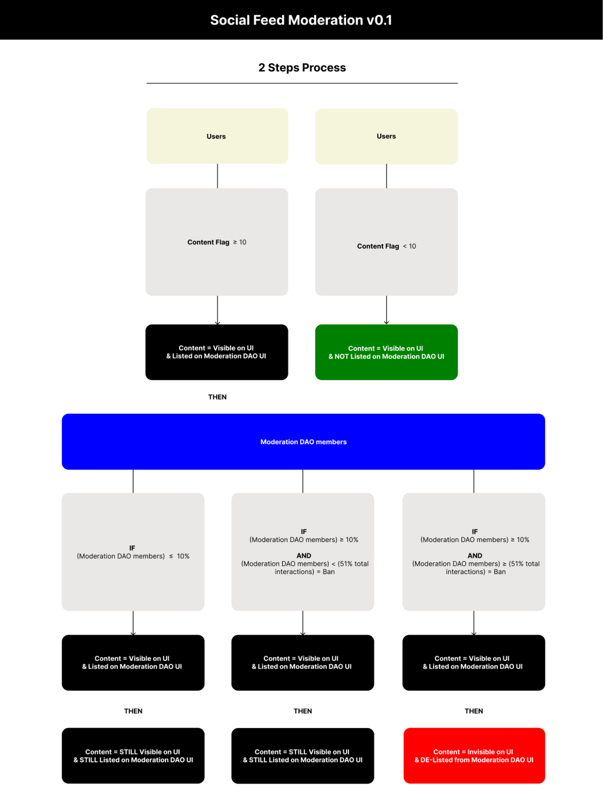
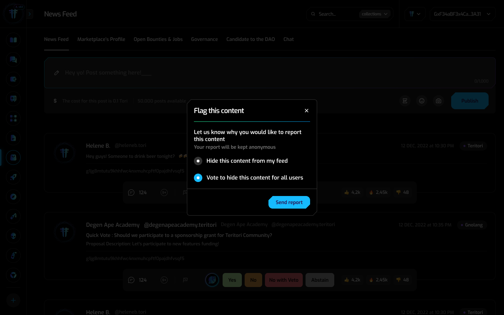
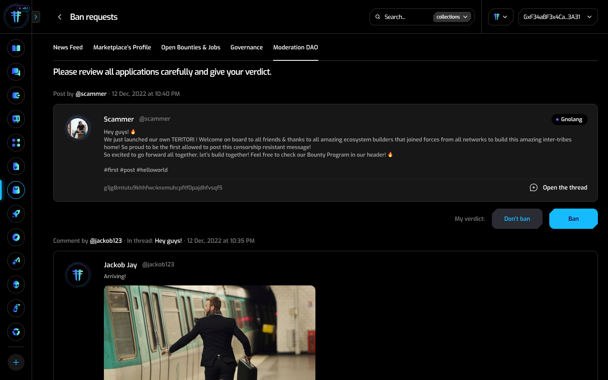
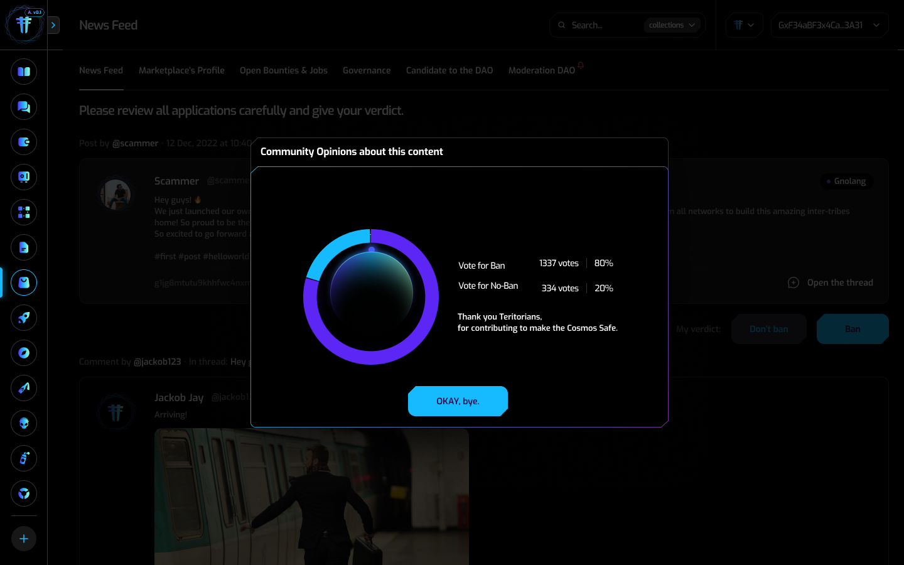

# Gno.land Moderation DAO Module
*This blog post is written by the Teritori team, whose focus is to allow organizations to communicate and interact in a resilient and transparent way. Teritori is a partner and grantee of Gno.land.*

When it comes to the complex subject of discussion forums and decentralized social networks, numerous technical and philosophical questions arise.
Imagining a 24/7 online communication system whose administration cannot be compromised or censored by any entity or individual is one of the most intriguing challenges of the decade.
Approximately 10 months ago, the Teritori core team decided to explore the new possibilities offered by Gno.land on the theme of decentralized moderation and to build the foundation for future generations of developers to create resilient, robust, and autonomous applications.

## The vision

### About Teritori

Teritori is a decentralized Operating System for individuals & communities that allows organizations to communicate and interact in a resilient and transparent way. Its core components include the creation of a decentralized User Profile for individuals & organizations as well as a dApp Store allowing users to pick their favorite services for daily usage and developers to list their product in order to grow their user base. Finally, Teritori backbone, its P2P messenger application that will enable users to create resilient token-gated groups in a click will even allow non-crypto-native users to get onboard as this feature doesn't even require a wallet connection to get started.

### Teritori <> Gno.land

Convinced of the benefits of offering a contribution-based consensus model and taking advantage of an interpreted version of Golang, the Teritori core team aims to become one of the most prolific contributors to Gno.land. Our plan is to focus on features that enable the coordination of organizations and individuals via governance, communications, and collaboration. Eventually, all the features listed on Teritori will be accessible in the Gno.land network, contributing to the growth of the ecosystem.

### PoC and iterations

Another important point to emphasize is that the Teritori core team intends to improve the features it deploys on Gno.land by taking advantage of the user test phases to collect feedback that will enable iteration and improvement of the service. As a result, the “Proof-of-Concept” (“PoC”) presented in this article will be subject to updates and evolutions, which will be communicated in due course, as will the associated test phases.

## What is the Gno Moderation Module?

The Gno Moderation Module is a smart contract (“realm”) that enables a decentralized, autonomous organization (DAO) to manage the moderation of a forum or social thread through a transparent on-chain vote.

### Let’s take an example:

Imagine a simple social network similar to Instagram, in which all content is decentralized (using IPFS for images, videos, music etc.). For each post, users sign in via their wallet to post content, and no centralized administrator can delete this content. The freedom offered by this type of decentralized application is immense since even as developers of the application, it is impossible to delete the content. Therefore, we can consider this “space of freedom” as a “common space” unlike any application owned by a private company and hosted on centralized infrastructure.
With this radical freedom for the user comes a great responsibility— to collectively ensure the security of this space rather than delegating the responsibility to moderators employed by a commercial enterprise. This is why we’ve created the “Gno Moderation Module.”


### How does it work?



The Gno Moderation Module allows users to notify the moderation DAO community that they wish to report content. Through this action (permitted by the smart contract), they inform the DAO community that the content is inappropriate.



Once the content has been reported a certain number of times (10 times in this PoC) by users (who may or may not be members of the Moderation DAO), an on-chain proposal is automatically created.



This on-chain proposal is then listed in the Moderation DAO tab on the Social Feed as well as on the Moderation DAO profile proposals feed so all Moderation DAO members can vote on it. A debate can take place to discuss the best choice for the content.



Moderation DAO members have three voting options:
- Ban the content in question
- Abstain
- Do not ban the content in question

Once the required vote quota has been reached, the contract automatically executes the voted decision.

## The Current Status:

The Teritori core team received a grant from the Gno.land core team to build the necessary tools for decentralized moderation.

To accomplish this task, we divided our work into five main stages:
1. Build “DAO” standards to establish the fundamental building blocks and ensure a modular approach in the long term for various tools.
2. Build a “DAO” deployer that allows non-tech users to easily utilize the different standards.
3. Build a customizable Moderation Module that can cater to a wide range of use cases. For example, if we replace the social feed with a service marketplace, the Moderation Module can transform into a “Justice Module” that resolves conflicts between sellers and buyers on a decentralized platform and serves as an escrow system.
4. Develop the user experience that allows for large-scale experimentation with the Moderation Module within a dedicated context of an active social feed. Here, we created a social feed realm and enabled non-developer Gno.land users to participate in the full-scale experience.
5. Establish interactions between smart contracts (r/boards, r/socialfeed, /r/users), conduct experiments to enhance their security, and identify emerging needs for these innovative use cases.

### What does a DAO realm look like?

- We decided to build two different DAO standards, using two different approaches of modularity:
- Aragon DAO Standard, based on the amazing work of [the Aragon team](https://aragon.org/) (using Solidity)
- [DAODAO](https://github.com/DA0-DA0) smart contract, using CosmWasm, that allows more modularity.


Here is an example, with the DAODAO contract ported into Gnolang:
[Source](https://testnet.gno.teritori.com/r/demo/dao_realm_v6/dao_realm.gno)

```go
package dao_realm

import (
	"encoding/base64"
	"std"
	"strings"
	"time"

	dao_core "gno.land/p/demo/daodao/core_v16"
	dao_interfaces "gno.land/p/demo/daodao/interfaces_v16"
	proposal_single "gno.land/p/demo/daodao/proposal_single_v16"
	voting_group "gno.land/p/demo/daodao/voting_group_v17"
	"gno.land/p/demo/ujson_v5"
	"gno.land/r/demo/groups_v22"
	modboards "gno.land/r/demo/modboards_v9"
)

var (
	daoCore       dao_interfaces.IDAOCore
	mainBoardName = "dao_realm"
	groupName     = mainBoardName + "_voting_group"
	groupID       groups.GroupID
)

func init() {
	modboards.CreateBoard(mainBoardName)

	votingModuleFactory := func(core dao_interfaces.IDAOCore) dao_interfaces.IVotingModule {
		groupID = groups.CreateGroup(groupName)
		groups.AddMember(groupID, "g1747t5m2f08plqjlrjk2q0qld7465hxz8gkx59c", 1, "")
		groups.AddMember(groupID, "g108cszmcvs4r3k67k7h5zuhm4el3qhlrxzhshtv", 1, "")
		groups.AddMember(groupID, "g14u5eaheavy0ux4dmpykg2gvxpvqvexm9cyg58a", 1, "")
		groups.AddMember(groupID, "g1ckn395mpttp0vupgtratyufdaakgh8jgkmr3ym", 1, "")
		groups.AddMember(groupID, std.GetOrigCaller().String(), 1, "")
		return voting_group.NewVotingGroup(groupID)
	}

	proposalModulesFactories := []dao_interfaces.ProposalModuleFactory{
		func(core dao_interfaces.IDAOCore) dao_interfaces.IProposalModule {
			tt := proposal_single.Percent(100) // 1%
			tq := proposal_single.Percent(100) // 1%
			return proposal_single.NewDAOProposalSingle(core, &proposal_single.DAOProposalSingleOpts{
				MaxVotingPeriod: time.Hour * 24 * 42,
				Threshold: proposal_single.Threshold{ThresholdQuorum: &proposal_single.ThresholdQuorum{
					Threshold: proposal_single.PercentageThreshold{Percent: &tt},
					Quorum:    proposal_single.PercentageThreshold{Percent: &tq},
				}},
			})
		},
	}

	messageHandlersFactories := []dao_interfaces.MessageHandlerFactory{
		func(core dao_interfaces.IDAOCore) dao_interfaces.MessageHandler {
			return groups.NewAddMemberHandler()
		},
		func(core dao_interfaces.IDAOCore) dao_interfaces.MessageHandler {
			return groups.NewDeleteMemberHandler()
		},
		func(core dao_interfaces.IDAOCore) dao_interfaces.MessageHandler {
			// TODO: add a router to support multiple proposal modules
			propMod := core.ProposalModules()[0]
			return proposal_single.NewUpdateSettingsHandler(propMod.Module.(*proposal_single.DAOProposalSingle))
		},
		func(core dao_interfaces.IDAOCore) dao_interfaces.MessageHandler {
			return modboards.NewCreateBoardHandler()
		},
		func(core dao_interfaces.IDAOCore) dao_interfaces.MessageHandler {
			return modboards.NewDeletePostHandler()
		},
	}

	daoCore = dao_core.NewDAOCore(votingModuleFactory, proposalModulesFactories, messageHandlersFactories)
}

func Render(path string) string {
	return "[[board](/r/demo/modboards:" + mainBoardName + ")]\n\n" + daoCore.Render(path)
}

func VoteJSON(moduleIndex int, proposalID int, voteJSON string) {
	module := dao_core.GetProposalModule(daoCore, moduleIndex)
	if !module.Enabled {
		panic("proposal module is not enabled")
	}
	module.Module.VoteJSON(proposalID, voteJSON)
}

func Execute(moduleIndex int, proposalID int) {
	module := dao_core.GetProposalModule(daoCore, moduleIndex)
	if !module.Enabled {
		panic("proposal module is not enabled")
	}
	module.Module.Execute(proposalID)
}

func ProposeJSON(moduleIndex int, proposalJSON string) {
	module := dao_core.GetProposalModule(daoCore, moduleIndex)
	if !module.Enabled {
		panic("proposal module is not enabled")
	}
	module.Module.ProposeJSON(proposalJSON)
}

func getProposalsJSON(moduleIndex int, limit int, startAfter string, reverse bool) string {
	module := dao_core.GetProposalModule(daoCore, moduleIndex)
	return module.Module.ProposalsJSON(limit, startAfter, reverse)
}
```

### Public Grant Report:

You can find the full report of [Teritori Core’s journey here](https://github.com/gnolang/hackerspace/issues/7). 

### Resources:

Documentation:
- [Gno Moderation DAO](https://github.com/TERITORI/gno/blob/teritori-unified/examples/gno.land/r/demo/teritori/MODERATION_DAO.md)

Packages:
- [https://testnet.gno.teritori.com/r/demo/groups_v22](https://testnet.gno.teritori.com/r/demo/groups_v22)
- [https://testnet.gno.teritori.com/p/demo/daodao/interfaces_v16](https://testnet.gno.teritori.com/p/demo/daodao/interfaces_v16)

Tutorial:
- [Gno.land Social Feed Moderation on Teritori](https://teritori.gitbook.io/teritori-whitepaper/gno.land/introducing-gno.land-social-feed-v0.1#social-feed-moderation)
